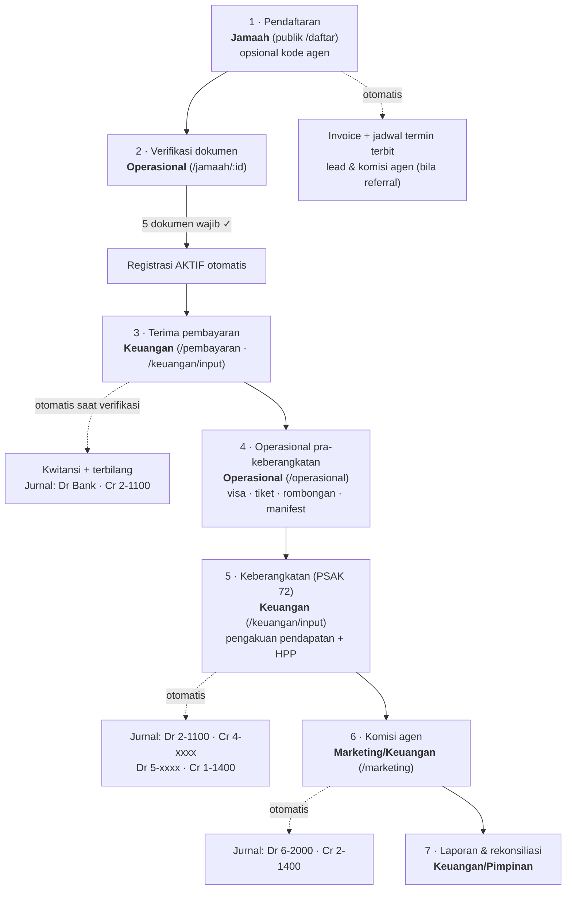

# Panduan Pengguna Safar — Alur Transaksi & Peran (RBAC)

Manual ini menjelaskan **siapa melakukan apa, di halaman mana, dan apa yang terjadi otomatis di belakang layar** — mengikuti alur bisnis dari pendaftaran jamaah sampai laporan keuangan.

Akun demo (password `safar123`): `admin@` · `keuangan@` · `ops@` · `marketing@` · `pimpinan@` — semua `safar.co.id`.

---

## 1. Enam Peran dan Tanggung Jawabnya

| Peran | Siapa | Tanggung jawab utama |
|---|---|---|
| **Admin** | Pengelola sistem | Semua akses + kelola pengguna, role, audit log |
| **Marketing** | Tim penjualan | Paket & jadwal, agen & referral, leads, persetujuan komisi |
| **Operasional** | Tim ops/dokumen | Verifikasi dokumen jamaah, manifest, visa, tiket, rombongan, checklist |
| **Keuangan** | Kasir & akuntan | Pembayaran, kwitansi, 4 transaksi akuntansi, jurnal, rekonsiliasi, laporan keuangan |
| **Pimpinan** | Direksi | **Hanya melihat**: dashboard & seluruh laporan |
| **Jamaah** | Pelanggan | Portal mandiri: status, bayar (VA), unggah dokumen, itinerary |

> Aturan teknis: **Admin selalu lolos semua pemeriksaan role.** Pimpinan bisa membuka halaman keuangan/operasional tetapi tombol aksi (simpan/posting/verifikasi) ditolak server (403).

---

## 2. Alur Transaksi End-to-End — Siapa Melakukan Apa

### Langkah demi langkah

| # | Transaksi | Siapa | Di halaman | Yang terjadi otomatis |
|---|---|---|---|---|
| 1 | **Pendaftaran jamaah** (pilih paket → data diri → dokumen → kamar → skema bayar → konfirmasi akad wakalah) | **Jamaah** sendiri, atau Marketing mendampingi | `/daftar` (tanpa login) | Nomor registrasi `UMR/HAJ-tahun-seri`; kuota kursi berkurang; **invoice + jadwal termin** terbit (cicilan = DP 5 jt + 5 termin); bila diisi **kode agen** → lead terkonversi + komisi *pending*. Validasi otomatis: paspor ≥ 7 bulan setelah keberangkatan, perempuan < 45 th wajib mahram, kuota real-time |
| 2 | **Verifikasi dokumen** (KTP, KK, Paspor, Pas Foto, Vaksin; Buku Nikah opsional) | **Operasional** | `/jamaah` → klik nama → tombol ✓ Verifikasi / Tolak | Saat 5 dokumen wajib terverifikasi → status registrasi menjadi **Aktif** |
| 3 | **Catat pembayaran jamaah** (DP/termin/pelunasan) | **Keuangan** | `/pembayaran` → **Kelola**, atau `/keuangan/input` → *Terima Pembayaran* | Pembayaran tercatat *pending* → setelah **diverifikasi Keuangan**: termin lunas, **kwitansi bernomor + terbilang** terbit, **jurnal otomatis Dr Bank/Kas · Cr 2-1100 Uang Muka Jamaah** (dana jamaah = liabilitas, BUKAN pendapatan) |
| 4 | **Bayar biaya vendor** (hotel/tiket/visa/katering — bisa valas SAR/USD) | **Keuangan** | `/keuangan/input` → *Pembayaran Biaya* | Jurnal multi-baris dalam IDR × kurs; pelunasan hutang valas menghitung **selisih kurs → 7-1000**; biaya menempel ke **cost center keberangkatan** |
| 5 | **Update visa, tiket, rombongan** | **Operasional** | `/operasional` → pilih keberangkatan → **Ubah** | Status visa (Proses/Biometrik/Terbit) & PNR tampil di manifest; paspor < 7 bulan ditandai merah otomatis |
| 6 | **Pengakuan pendapatan saat keberangkatan** (PSAK 72) + HPP | **Keuangan** | `/keuangan/input` → *Pengakuan Pendapatan* | Jurnal reclass **Dr 2-1100 · Cr 4-1000/4-2000**; HPP: **Dr 5-xxxx · Cr 1-1400 Uang Muka Vendor**. Sejak ini laba per paket muncul di dashboard & laporan |
| 7 | **Persetujuan komisi agen** | **Marketing** atau **Keuangan** | `/marketing` → *Setujui & Posting* | Jurnal **Dr 6-2000 Beban Komisi · Cr 2-1400 Hutang Komisi**; KPI "Komisi Terhutang" = saldo riil akun 2-1400 |
| 8 | **Jurnal manual & rekonsiliasi bank** | **Keuangan** | `/keuangan/jurnal` | Jurnal wajib **balance** (Σdebit = Σkredit — server menolak yang pincang); rekonsiliasi: cocokkan mutasi koran, skedul penyesuaian dua sisi |
| 9 | **Laporan** (laba rugi, neraca, laba per paket, aging, kepatuhan dokumen, kesiapan) + ekspor Excel/PDF | **Keuangan** & **Pimpinan** (operasional utk laporan ops) | `/laporan-keuangan` · `/laporan-operasional` | Semua angka diagregasi langsung dari jurnal — neraca selalu seimbang |
| 10 | **Kelola pengguna & audit** | **Admin** | `/admin` | Setiap mutasi keuangan & data sensitif terekam di audit log (aktor, aksi, nilai) |
| 11 | **Portal jamaah** (cek status, bayar via VA, unggah dokumen, itinerary) | **Jamaah** | `/portal` — login **No. Registrasi + NIK** | Countdown keberangkatan, "Perlu Tindakan" otomatis (termin jatuh tempo, dokumen kurang), unduh ringkasan invoice/kwitansi |

---

## 3. Matriks Hak Akses (RBAC)

✅ = kelola (buat/ubah) · 👁 = hanya lihat · — = tidak ada akses. **Admin = ✅ di semua baris.**

| Modul / Halaman | Marketing | Operasional | Keuangan | Pimpinan | Jamaah |
|---|:-:|:-:|:-:|:-:|:-:|
| Dashboard eksekutif (`/`) | 👁 | 👁 | 👁 | 👁 | — |
| Paket & jadwal (`/paket`) | ✅ | — | 👁 (HPP) | 👁 | 👁 (wizard) |
| Data jamaah & dokumen (`/jamaah`) | 👁 | ✅ verifikasi | 👁 | 👁 | — |
| Pendaftaran (`/daftar`) | ✅ (mendampingi) | — | — | — | ✅ (publik) |
| Pembayaran & kwitansi (`/pembayaran`) | 👁 piutang | — | ✅ catat + verifikasi | 👁 | — |
| Manifest, visa, tiket (`/operasional`) | — | ✅ | — | 👁 | — |
| Laporan operasional (aging/dokumen/kesiapan) | — | ✅ + ekspor | 👁 + ekspor | 👁 | — |
| Input Transaksi 4 tipe (`/keuangan/input`) | — | — | ✅ | — | — |
| Jurnal, buku besar, COA, rekonsiliasi | — | — | ✅ | 👁 | — |
| Laporan keuangan (LR/Neraca/per Paket) | 👁 laba per paket | — | ✅ + ekspor | 👁 + ekspor | — |
| Agen & leads (`/marketing`) | ✅ | — | 👁 | 👁 | — |
| Persetujuan komisi | ✅ | — | ✅ | 👁 | — |
| Pengguna, role, audit log (`/admin`) | — | — | — | — | — |
| Portal jamaah (`/portal`) | — | — | — | — | ✅ |

---

## 4. Peta Jurnal Otomatis (siapa memicu → jurnal apa)

Semua jurnal dibuat mesin melalui satu pintu (*journal engine*) dan **wajib balance**. Referensi lengkap: dokumen *Chart of Accounts* (alur A–F).

| Kode | Pemicu | Oleh | Jurnal |
|---|---|---|---|
| A/B | Verifikasi pembayaran jamaah | Keuangan | **Dr** 1-1100/1-12xx Bank/Kas · **Cr** 2-1100 Uang Muka Jamaah |
| C | Pembayaran biaya / DP vendor (opsional valas) | Keuangan | **Dr** 1-1400 atau 5-xxxx (IDR × kurs) · **Cr** Bank — selisih kurs realisasi → 7-1000 |
| D | Pengakuan pendapatan saat keberangkatan | Keuangan | **Dr** 2-1100 · **Cr** 4-1000/4-2000 |
| E | Pengakuan HPP saat keberangkatan | Keuangan | **Dr** 5-1000…5-7000 per komponen · **Cr** 1-1400 |
| F | Persetujuan komisi agen | Marketing/Keuangan | **Dr** 6-2000 · **Cr** 2-1400 |
| — | Jurnal manual (adm bank, penyesuaian, dsb.) | Keuangan | Bebas, wajib balance |

**Prinsip yang dijaga sistem** (tidak bisa dilanggar pengguna): dana jamaah adalah **liabilitas** sampai keberangkatan (akad wakalah/ijarah, PSAK 72); setiap keberangkatan adalah **cost center**; setiap jurnal balance; setiap mutasi terekam audit log.

---

## 5. Skenario Cepat per Peran

**Marketing — hari kerja biasa**: buka `/paket` (tambah paket/jadwal bila ada program baru) → `/marketing` (registrasi agen baru, cek leads & konversi, setujui komisi yang jatuh hak) → dampingi calon jamaah mengisi `/daftar` dengan kode referral agen.

**Operasional — menjelang keberangkatan**: `/jamaah` tab *Dokumen Belum Lengkap* → verifikasi/tolak dokumen masuk → `/operasional` perbarui visa & PNR → `/laporan-operasional` tab *Kesiapan* — kejar metrik yang merah (paspor bermasalah, visa belum terbit).

**Keuangan — siklus harian & bulanan**: `/pembayaran` verifikasi setoran masuk (kwitansi & jurnal otomatis) → `/keuangan/input` bayar vendor & (saat tanggal keberangkatan) posting pengakuan pendapatan + HPP → akhir bulan: `/keuangan/jurnal` rekonsiliasi bank → `/laporan-keuangan` tutup laporan, ekspor Excel.

**Pimpinan**: cukup `/` (dashboard), `/laporan-keuangan`, `/laporan-operasional` — semua angka live dari jurnal, tanpa risiko mengubah data.

**Jamaah**: daftar di `/daftar` → simpan nomor registrasi → pantau semuanya di `/portal` (bayar VA BSI, unggah kekurangan dokumen dari ponsel).
